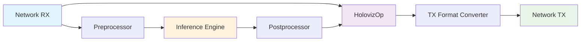
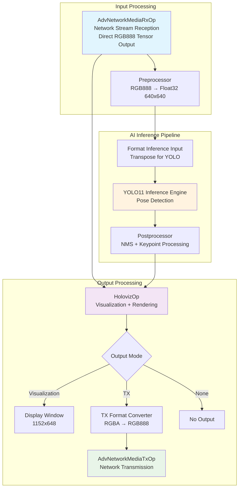
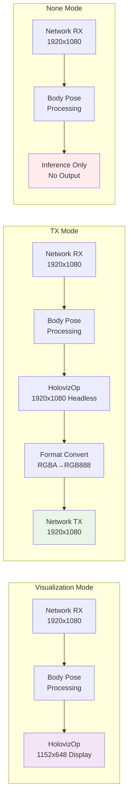

# Advanced Networking Inference Demo

The Advanced Networking Inference Demo is a real-time AI-powered video processing application that combines NVIDIA's advanced networking capabilities with body pose estimation. This application demonstrates professional-grade media streaming with real-time AI inference, supporting both visualization and network transmission modes.

## Overview

This application showcases the integration of high-performance networking, real-time AI inference, and flexible output options. It receives media streams over advanced network infrastructure using NVIDIA's Rivermax SDK, performs body pose estimation using YOLO models, and can either display results locally or retransmit processed video over the network.

### Key Features

- **Real-time AI Inference**: Body pose estimation using YOLO11 pose detection models
- **High-Performance Networking**: SMPTE 2110 compliant media streaming with Rivermax SDK
- **Flexible Output Modes**: 
  - **Visualization**: Real-time windowed display with pose overlays
  - **TX**: Headless network transmission of processed video
  - **None**: Processing-only mode for testing and benchmarking
- **GPU Acceleration**: End-to-end GPU processing with zero-copy operations
- **Format Support**: RGB888, YUV420, NV12 video formats
- **Configurable Pipeline**: Modular design with configurable processing stages

## Architecture Overview

### High-Level Pipeline Flow



### Detailed Pipeline Architecture



### Output Mode Configurations



## Requirements

### Hardware Requirements
- **CPU**: Multi-core x86_64 or ARM64 processor
- **GPU**: NVIDIA GPU with CUDA support (recommended: RTX 3060 or higher)
- **Network**: NVIDIA ConnectX-6 or later NIC for advanced networking
- **Memory**: 8GB+ RAM, 4GB+ GPU memory
- **Storage**: SSD recommended for model loading

### Software Requirements
- **OS**: Ubuntu 20.04+ or compatible Linux distribution
- **NVIDIA Drivers**: GPU drivers 525.xx or later
- **CUDA**: CUDA 12.0 or later
- **Rivermax SDK**: NVIDIA Rivermax for advanced networking
- **MOFED**: Mellanox OFED drivers 5.8+ (for ConnectX NICs)
- **Python**: Python 3.8+ (for Python version)

### AI Model Requirements
- **YOLO11 Pose Model**: `yolo11l-pose.onnx` (downloaded automatically during build)
- **Model Source**: Ultralytics YOLO11 Large Pose model
- **Model Size**: ~50MB disk space
- **Input Format**: 640x640 RGB images (automatically resized by preprocessor)
- **Inference Runtime**: TensorRT for optimal performance
- **Based on**: [Body Pose Estimation](../body_pose_estimation/README.md) application

## Installation & Setup

### 1. Build Docker Container

```bash
# Build Rivermax-enabled container
./dev_container build --docker_file operators/advanced_network/Dockerfile \
    --img holohub:rivermax-inference --build-args "--target rivermax"
```

### 2. Launch Container

```bash
# Launch with networking and GPU support
./operators/advanced_network/run_rivermax.sh
```

### 3. Build Application

```bash
# Build the inference demo application
# Note: This will automatically download the YOLO11 pose model during build
./run build adv_networking_inference_demo --configure-args "-DANO_MGR=rivermax"

# Build Python dependencies if using Python version
./run build adv_networking_inference_demo --language python --configure-args "-DANO_MGR=rivermax"
```

**Note**: The YOLO pose estimation code in this application is derived from the [Body Pose Estimation](../body_pose_estimation/README.md) HoloHub application, adapted for advanced networking workflows.

> **Model License**: This application uses YOLO11 models from [Ultralytics](https://docs.ultralytics.com/tasks/pose/). Users are responsible for ensuring that their use of the model complies with Ultralytics' license terms.

### 4. System Dependencies

Install required system packages and Python dependencies:

```bash
# Install system dependencies
apt-get update && apt-get install -y \
    libgl1 \
    ffmpeg \
    curl

# Install Python dependencies for AI inference
pip3 install \
    ultralytics \
    onnx \
    onnx-graphsurgeon

# Note: ultralytics package provides the 'yolo' command-line tool
# used for model downloading and conversion
```

### 5. Download and Prepare AI Models

The application uses YOLO11 pose model for body pose estimation. The model is automatically downloaded during the build process, but you can also manually prepare it:

#### Automatic Model Download (Recommended)

When building the application, the model is automatically downloaded and converted:

```bash
# The build process automatically runs:
# 1. Downloads yolo11l-pose.pt model from Ultralytics
# 2. Converts to ONNX format using: yolo export model=yolo11l-pose.pt format=onnx
# 3. Places yolo11l-pose.onnx in the data directory
```

#### Manual Model Preparation

If you need to manually download and prepare the model:

```bash
# Create data directory
mkdir -p data/adv_networking_inference_demo
cd data/adv_networking_inference_demo

# Install ultralytics if not already installed
pip3 install ultralytics

# Download and convert YOLO11 pose model to ONNX format
yolo export model=yolo11l-pose.pt format=onnx

# The exported model (yolo11l-pose.onnx) will be created in the current directory
```

#### Model Requirements

- **Model Name**: `yolo11l-pose.onnx` (must match exactly)
- **Model Type**: YOLO11 Large Pose Detection model
- **Format**: ONNX format for TensorRT inference
- **Size**: Approximately 50MB
- **Input**: 640x640 RGB images
- **Output**: Pose keypoints with bounding boxes

#### YOLO11 Pose Keypoint Structure

The YOLO11 pose model detects 17 standard keypoints per person:

```
Keypoint Index | Body Part
0-1           | Nose
2-3           | Left Eye  
4-5           | Right Eye
6-7           | Left Ear
8-9           | Right Ear
10-11         | Left Shoulder
12-13         | Right Shoulder
14-15         | Left Elbow
16-17         | Right Elbow
18-19         | Left Wrist
20-21         | Right Wrist
22-23         | Left Hip
24-25         | Right Hip
26-27         | Left Knee
28-29         | Right Knee
30-31         | Left Ankle
32-33         | Right Ankle
```

The application also generates connecting segments between keypoints to create a pose skeleton visualization.

## Configuration

### Complete Configuration Example

```yaml
# Output configuration - choose one mode
output_config:
  output_type: "visualization"  # Options: "visualization", "tx", "none"

# Advanced networking setup
advanced_network:
  cfg:
    version: 1
    manager: "rivermax"
    master_core: 6
    memory_regions:
      - name: "Data_RX_GPU"
        kind: "device"
        num_bufs: 432000
        buf_size: 1440
      - name: "Data_TX_GPU"
        kind: "device"
        num_bufs: 43200
        buf_size: 1440
    interfaces:
      - name: data1
        address: cc:00.1
        rx:
          queues:
            - name: "Data"
              rivermax_rx_settings:
                local_ip_address: 2.1.0.12
                destination_ip_address: 224.1.1.2
                destination_port: 50001
        tx:
          queues:
            - name: "tx_q_1"
              rivermax_tx_settings:
                local_ip_address: 2.1.0.12
                destination_ip_address: 224.1.1.3
                destination_port: 50002

# RX configuration
advanced_network_media_rx:
  interface_name: cc:00.1
  queue_id: 0
  video_format: RGB888
  frame_width: 1920
  frame_height: 1080
  bit_depth: 8
  hds: true
  output_format: tensor      # Direct tensor output for optimal performance
  memory_location: device

# TX configuration (for TX mode)
advanced_network_media_tx:
  interface_name: cc:00.1
  queue_id: 0
  video_format: RGB888
  frame_width: 1920        # TX resolution (HolovizOp renders at this resolution)
  frame_height: 1080       # TX resolution (HolovizOp renders at this resolution)
  bit_depth: 8

# AI inference settings
preprocessor:
  in_tensor_name: ""       # Default input tensor name from RX operator
  out_tensor_name: "preprocessed"  # Named output tensor for inference
  in_dtype: "rgb888"       # Direct input from RX operator
  resize_width: 640
  resize_height: 640
  out_dtype: "float32"
  scale_min: 0.0
  scale_max: 1.0

inference:
  backend: "trt"
  pre_processor_map:
    "yolo_pose": ["preprocessed"]
  inference_map:
    "yolo_pose": ["inference_output"]
  input_on_cuda: true
  is_engine_path: false
  # Note: model_path_map is automatically configured in code to:
  # model_path_map:
  #   "yolo_pose": "/path/to/data/yolo11l-pose.onnx"

postprocessor:
  iou_threshold: 0.5
  score_threshold: 0.5
  image_dim: 640            # Must match preprocessor resize dimensions

# Visualization settings
holoviz:
  width: 1152
  height: 648
  tensors:
    - name: ""
      type: color
    - name: boxes
      type: rectangles
      color: [0.0, 1.0, 0.0, 1.0]
    - name: segments
      type: lines
      color: [0.0, 1.0, 0.0, 1.0]
    # ... keypoint configurations
```

### Output Mode Selection

#### Visualization Mode
```yaml
output_config:
  output_type: "visualization"
```
- **Use Case**: Development, debugging, demo purposes
- **Display**: Windowed application with pose overlays
- **Resolution**: Configurable (default: 1152x648)
- **Performance**: Lower GPU memory usage

#### TX Mode
```yaml
output_config:
  output_type: "tx"
```
- **Use Case**: Production deployment, edge computing
- **Display**: Headless operation
- **Resolution**: Full input resolution (1920x1080)
- **Performance**: Optimized for network transmission

#### None Mode
```yaml
output_config:
  output_type: "none"
```
- **Use Case**: Testing, benchmarking, inference-only
- **Display**: No output
- **Performance**: Maximum inference throughput

## Running the Application

### Environment Setup

```bash
# Set up Python path for modules
export PYTHONPATH=${PYTHONPATH}:/opt/nvidia/holoscan/python/lib:$PWD/build/python/lib:$PWD

# Verify network interface (adjust PCIe address as needed)
lspci | grep -i mellanox
# Should show your ConnectX NIC at the configured address (e.g., cc:00.1)
```

### Launch Application

```bash
# Python version (recommended)
cd applications/adv_networking_inference_demo
python adv_networking_inference_demo.py

# With custom config
python adv_networking_inference_demo.py --config custom_config.yaml

# With custom data path
python adv_networking_inference_demo.py --data /path/to/models

# C++ version (if built)
./build/adv_networking_inference_demo/applications/adv_networking_inference_demo/cpp/adv_networking_inference_demo adv_networking_inference_demo.yaml
```

### Command Line Options

```bash
python adv_networking_inference_demo.py --help

Options:
  -c, --config CONFIG    Path to YAML configuration file
  -d, --data DATA        Path to model data directory
```

## Performance Optimization

### System Tuning

```bash
# CPU isolation (reserve cores for networking)
echo "isolcpus=12,13" >> /etc/default/grub
update-grub && reboot

# Huge pages configuration
echo 1024 > /sys/kernel/mm/hugepages/hugepages-2048kB/nr_hugepages

# Network interface optimization
echo performance > /sys/devices/system/cpu/cpu12/cpufreq/scaling_governor
echo performance > /sys/devices/system/cpu/cpu13/cpufreq/scaling_governor
```

### Configuration Tuning

```yaml
# High-performance scheduler settings
scheduler:
  worker_thread_number: 8
  check_recession_period_ms: 0
  stop_on_deadlock_timeout: 500

# Optimized memory regions
advanced_network:
  cfg:
    memory_regions:
      - name: "Data_RX_GPU"
        kind: "device"
        num_bufs: 432000  # Adjust based on frame rate
        buf_size: 1440    # Adjust based on resolution

# CUDA stream pool optimization (automatically configured)
# The application creates a shared CUDA stream pool with:
# - reserved_size: 2 (for preprocessor and TX format conversion)
# - max_size: 6 (reduced from 8 since input format converter was removed)
# This optimization is automatically applied in the code
```

### Pipeline Connection Details

The application uses specific port connections for optimal data flow:

```python
# RX operator connections
adv_net_media_rx -> holoviz: ("out_video_buffer", "receivers")
adv_net_media_rx -> preprocessor: ("out_video_buffer", "")

# Inference pipeline connections  
preprocessor -> format_input: ("tensor", "in")
format_input -> inference: ("out", "receivers")
inference -> postprocessor: ("transmitter", "in")
postprocessor -> holoviz: ("out", "receivers")

# TX pipeline connections (TX mode only)
holoviz -> tx_format_converter: ("render_buffer_output", "")
tx_format_converter -> tx_operator: ("", "input")
```

### Performance Monitoring

```bash
# Monitor GPU utilization
nvidia-smi -l 1

# Monitor network performance
sar -n DEV 1

# Monitor CPU usage
htop

# Application-specific metrics (enable in config)
advanced_network:
  cfg:
    log_level: "info"  # or "debug" for detailed metrics
```

## Troubleshooting

### Common Issues

1. **Network Interface Not Found**
   ```bash
   # Check PCIe address
   lspci | grep -i mellanox
   # Update interface address in config
   ```

2. **GPU Memory Issues**
   ```bash
   # Reduce buffer sizes or resolution
   nvidia-smi  # Check available memory
   ```

3. **Model Loading Errors**
   ```bash
   # Verify model path and format
   ls -la data/adv_networking_inference_demo/
   # Should show: yolo11l-pose.onnx
   
   # If model is missing, manually download:
   cd data/adv_networking_inference_demo/
   pip3 install ultralytics
   yolo export model=yolo11l-pose.pt format=onnx
   
   # Verify ONNX format and compatibility
   python3 -c "import onnx; print('ONNX version:', onnx.__version__)"
   ```

5. **YOLO Model Download Issues**
   ```bash
   # If automatic download fails during build:
   # 1. Check internet connectivity
   # 2. Verify ultralytics installation
   pip3 install --upgrade ultralytics
   
   # 3. Manual download alternative
   wget https://github.com/ultralytics/assets/releases/download/v8.3.0/yolo11l-pose.pt
   yolo export model=yolo11l-pose.pt format=onnx
   ```

4. **Performance Issues**
   ```bash
   # Check CPU isolation and governor settings
   cat /proc/cmdline | grep isolcpus
   cat /sys/devices/system/cpu/cpu*/cpufreq/scaling_governor
   ```

### Debug Configuration

```yaml
# Enable detailed logging
advanced_network:
  cfg:
    log_level: "debug"
    debug: 1

# Performance profiling
inference:
  verbose: true
  
# Memory usage monitoring  
scheduler:
  check_recession_period_ms: 1000  # Enable periodic checks
```

### Log Analysis

```bash
# Application logs
tail -f /var/log/holoscan/adv_networking_inference_demo.log

# System logs
dmesg | grep -i mellanox
journalctl -u holoscan-inference -f
```

## Example Use Cases

### 1. Security Monitoring System
- **Input**: IP camera streams via SMPTE 2110
- **Processing**: Real-time person detection and pose analysis
- **Output**: Processed video to monitoring stations

### 2. Sports Analytics
- **Input**: Broadcast video feeds
- **Processing**: Player pose estimation and tracking
- **Output**: Analytics dashboard with pose metrics

### 3. Medical Imaging
- **Input**: Surgical camera feeds
- **Processing**: Tool tracking and pose estimation
- **Output**: Enhanced video for surgical navigation

### 4. Industrial Automation
- **Input**: Manufacturing line cameras
- **Processing**: Worker pose analysis for safety
- **Output**: Alert systems and safety dashboards

## Integration Examples

### With Existing Video Infrastructure

```yaml
# Receive from broadcast equipment
advanced_network_media_rx:
  local_ip_address: 192.168.1.100
  destination_ip_address: 239.1.1.1  # Multicast
  destination_port: 5004

# Send to downstream systems
advanced_network_media_tx:
  destination_ip_address: 239.1.1.2
  destination_port: 5006
```

### With Cloud Services

```yaml
# Edge processing with cloud connectivity
output_config:
  output_type: "tx"
  
# Additional cloud streaming (configure separately)
cloud_streaming:
  endpoint: "rtmp://streaming-server/live"
  format: "h264"
```

## Implementation Notes

### Key Optimizations

The current implementation includes several performance optimizations:

1. **Direct Tensor Output**: RX operator outputs tensors directly (`output_format: tensor`) eliminating input format conversion
2. **Optimized CUDA Stream Pool**: Reduced stream pool size (max_size: 6) since input format converter was removed
3. **Named Tensor Outputs**: Preprocessor uses named output tensors (`out_tensor_name: "preprocessed"`) for reliable connections
4. **Resolution-Specific TX**: HolovizOp renders at TX resolution (1920x1080) when in TX mode for optimal quality

### Pipeline Evolution

This implementation represents an evolved pipeline architecture:
- **Previous**: RX → Format Converter → Preprocessor → ...
- **Current**: RX (direct tensor) → Preprocessor → ...

The removal of the input format converter reduces latency and memory usage while maintaining full functionality.

## Related Documentation

### Core Components
- [Advanced Network Operators](../../operators/advanced_network/README.md)
- [Advanced Network Media Operators](../../operators/advanced_network_media/README.md)
- [High Performance Networking Tutorial](../../tutorials/high_performance_networking/README.md)

### AI/ML Components  
- [Body Pose Estimation Application](../body_pose_estimation/README.md) - **Source of YOLO implementation**
- [Ultralytics YOLO11 Documentation](https://docs.ultralytics.com/tasks/pose/) - YOLO11 pose model details

### Holoscan Framework
- [Holoscan SDK Documentation](https://docs.nvidia.com/holoscan/)
- [Holoscan Operators Reference](https://docs.nvidia.com/holoscan/sdk-user-guide/operators.html)

## Support & Contributing

### Getting Help
- **Issues**: Report bugs and issues on the project repository
- **Discussions**: Join community discussions for questions and tips
- **Documentation**: Refer to NVIDIA Holoscan documentation for detailed API reference

### Contributing
- **Code**: Submit pull requests with improvements and new features
- **Documentation**: Help improve documentation and examples
- **Testing**: Share performance results and optimization tips

---

**Note**: This application requires proper hardware setup and network configuration. Refer to the High Performance Networking tutorial for detailed system preparation instructions.
