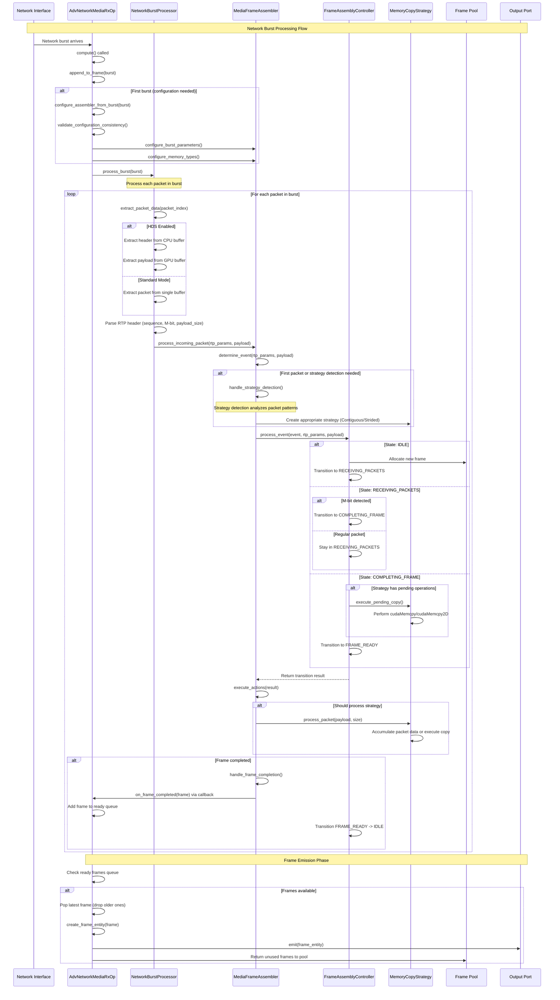
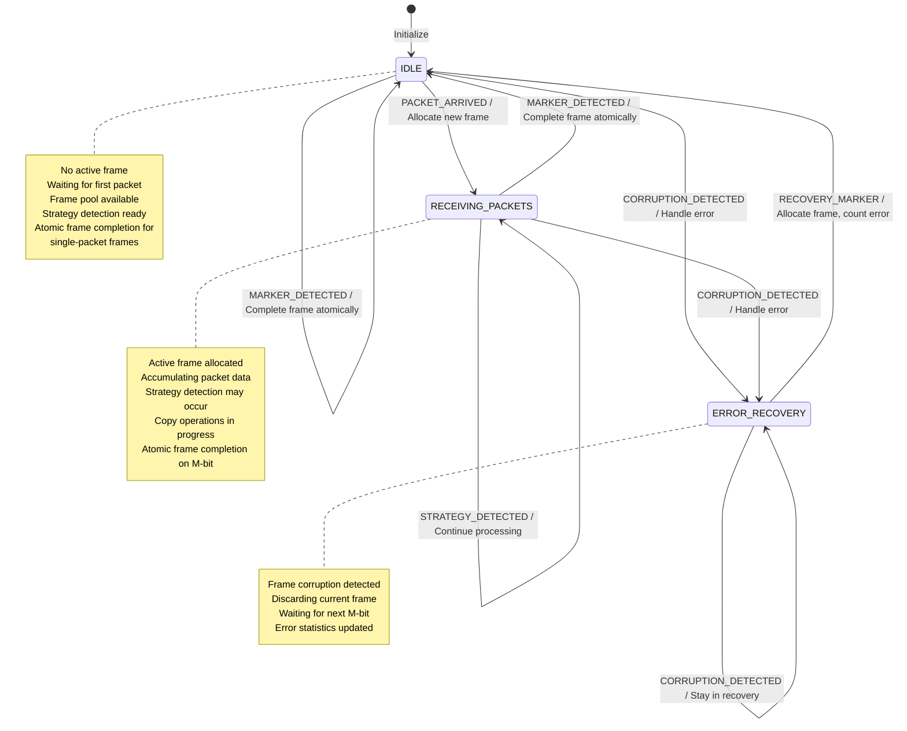
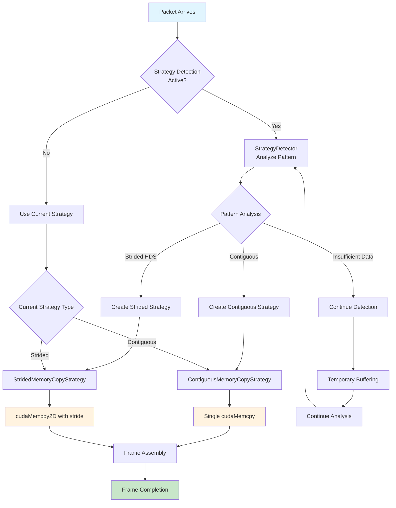

# Advanced Network Media RX Operator - Architecture Documentation

## Overview

The Advanced Network Media RX Operator is a sophisticated component that receives network bursts containing video frame packets and assembles them into complete video frames. This document provides a comprehensive analysis of the implementation, including sequential flows, state machine diagrams, and architectural patterns.

## Key Components

### 1. Core Classes and Their Responsibilities

#### Public API (`holoscan::ops` namespace)
- **`AdvNetworkMediaRxOp`**: Main operator interface, orchestrates the entire reception process
- **`MediaFrameAssembler`**: High-level frame assembly coordinator with automatic strategy detection
- **`NetworkBurstProcessor`**: Processes network bursts and extracts individual packets (pure packet processing)
- **`IFrameProvider`**: Interface for frame buffer allocation
- **`IFrameCompletionHandler`**: Callback interface for frame completion events

#### Internal Implementation (`holoscan::ops::detail` namespace)
- **`FrameAssemblyController`**: Core state machine managing frame assembly states
- **`IMemoryCopyStrategy`**: Strategy interface for different copy patterns
- **`ContiguousMemoryCopyStrategy`**: Efficient copying for contiguous packet layouts
- **`StridedMemoryCopyStrategy`**: Optimized copying for Header Data Split (HDS) scenarios
- **`StrategyDetector`**: Automatic detection of optimal copy strategy
- **`StrategyFactory`**: Factory for creating appropriate copy strategies

## Sequential Flow Diagram

The following diagram shows the complete flow from network burst arrival to frame emission:



## State Machine Diagram

The core state machine manages frame assembly with robust error handling. The diagram below shows **ALL** valid transitions with their triggering events and actions:

> **Note**: Nine suspicious/dead code transitions have been removed from the state machine:
> 1. `IDLE` → `RECEIVING_PACKETS` via `STRATEGY_DETECTED` (logically impossible)
> 2. `ERROR_RECOVERY` → `IDLE` via `MARKER_DETECTED` (redundant with `RECOVERY_MARKER`)
> 3. `FRAME_READY` → `RECEIVING_PACKETS` via `PACKET_ARRIVED` (logically impossible - transient state)
> 4. `FRAME_READY` → `COMPLETING_FRAME` via `MARKER_DETECTED` (logically impossible - transient state)
> 5. `FRAME_READY` → `ERROR_RECOVERY` via `CORRUPTION_DETECTED` (logically impossible - no operations in transient state)
> 6. `COMPLETING_FRAME` → `COMPLETING_FRAME` via `MARKER_DETECTED` (logically impossible - synchronous processing)
> 7. `RECEIVING_PACKETS` → `RECEIVING_PACKETS` via `COPY_EXECUTED` (dead code - event never sent)
> 8. `COMPLETING_FRAME` → `FRAME_READY` via `COPY_EXECUTED` (dead code - event never sent)
> 9. `COMPLETING_FRAME` → `COMPLETING_FRAME` via `PACKET_ARRIVED` (logically impossible - synchronous frame completion)



### State Transition Events and Their Sources

| **Event** | **Generated By** | **Conditions/Scenarios** |
|-----------|------------------|---------------------------|
| `PACKET_ARRIVED` | `MediaFrameAssembler::determine_event()` | • Regular packet processing<br/>• Strategy detection in progress<br/>• Strategy detection failed |
| `MARKER_DETECTED` | `MediaFrameAssembler::determine_event()` | • RTP packet with M-bit=1 (not in ERROR_RECOVERY state) |
| `COPY_EXECUTED` | Memory copy strategies | • Copy operation completed successfully |
| `CORRUPTION_DETECTED` | Multiple sources | • Packet integrity validation failed<br/>• Copy operation failed<br/>• Bounds validation failed |
| `RECOVERY_MARKER` | `MediaFrameAssembler::determine_event()` | • RTP packet with M-bit=1 while in ERROR_RECOVERY state |
| `STRATEGY_DETECTED` | `MediaFrameAssembler::determine_event()` | • Strategy detection completed successfully |
| `FRAME_COMPLETED` | `MediaFrameAssembler::handle_frame_completion()` | • Frame emission completed (triggers FRAME_READY → IDLE) |

### Comprehensive Transition Analysis

#### **From IDLE State:**
- **PACKET_ARRIVED** → RECEIVING_PACKETS: Regular packet starts new frame
- **MARKER_DETECTED** → IDLE: Single-packet frame completed atomically (complete→emit→allocate→idle)
- **CORRUPTION_DETECTED** → ERROR_RECOVERY: Invalid packet detected

#### **From RECEIVING_PACKETS State:**
- **PACKET_ARRIVED** → RECEIVING_PACKETS: Continue accumulating packets
- **STRATEGY_DETECTED** → RECEIVING_PACKETS: Strategy detection completed, continue processing
- **MARKER_DETECTED** → IDLE: Frame end marker received, complete atomically (complete→emit→allocate→idle)
- **CORRUPTION_DETECTED** → ERROR_RECOVERY: Packet/copy failure detected

#### **From ERROR_RECOVERY State:**
- **RECOVERY_MARKER** → IDLE: M-bit received, recovery successful
- **PACKET_ARRIVED** → ERROR_RECOVERY: Discard corrupted packets
- **CORRUPTION_DETECTED** → ERROR_RECOVERY: Additional corruption detected

### State Machine Improvements

**Final State Machine Statistics:**
- **Total Valid Transitions**: **8** (dramatically simplified from original 22)
- **States**: **3** (down from 5: IDLE, RECEIVING_PACKETS, ERROR_RECOVERY)
- **Eliminated Transient States**: **2** (COMPLETING_FRAME and FRAME_READY merged into atomic operations)
- **Atomic Frame Completion**: Single-operation frame completion with automatic new frame allocation
- **Reduced Complexity**: Eliminated all "impossible transition" edge cases

#### **Architectural Simplification: State Merging**

**Major Improvement**: Merged `COMPLETING_FRAME` and `FRAME_READY` into atomic operations within `RECEIVING_PACKETS` and `IDLE` states.

**Benefits Achieved:**
1. **Eliminated Transient States**: No more artificial intermediate states that execute instantly
2. **Atomic Frame Completion**: Frame completion, emission, and new frame allocation happen in single operation
3. **Simplified Mental Model**: Clear separation between "processing packets" and "waiting for packets"
4. **Removed Edge Cases**: All "impossible transition" scenarios eliminated by design
5. **Better Performance**: Fewer state transitions and cleaner execution paths

**Transformation Summary:**
- **Before**: `RECEIVING_PACKETS` → `COMPLETING_FRAME` → `FRAME_READY` → `IDLE` (3 transitions)
- **After**: `RECEIVING_PACKETS` → `IDLE` (1 atomic transition with complete→emit→allocate→idle)

**Eliminated States and Transitions:**
- `COMPLETING_FRAME` state and all its 8 associated transitions
- `FRAME_READY` state and all its 6 associated transitions  
- `FRAME_COMPLETED` events no longer needed for state transitions
- All "impossible transition" defensive code paths

#### **Atomic Frame Completion Pattern:**

The new design implements **atomic frame completion** that replaces the previous transient state pattern:

**New Atomic Pattern:**
1. **M-bit Detection**: `MARKER_DETECTED` event received in `RECEIVING_PACKETS` or `IDLE`
2. **Atomic Execution**: Single state transition performs all operations:
   - `should_complete_frame = true` → Execute final copy operations
   - `should_emit_frame = true` → Send frame to completion handler  
   - `should_allocate_new_frame = true` → Allocate new frame for next sequence
3. **Direct Transition**: State immediately transitions to `IDLE` ready for next packet
4. **Zero Intermediate States**: No temporary states, no complex transition chains

**Performance Benefits:**
- **Single transition** instead of 3-step chain
- **No state machine event overhead** for frame completion
- **Cleaner error handling** with fewer failure points
- **Simplified debugging** with direct cause-effect relationships

#### **Copy Execution Model:**
The memory copy system operates **independently** from state machine events:
1. **Strategy Processing**: Copy strategies execute internally during packet processing
2. **Local Handling**: `COPY_EXECUTED` results are handled locally in `execute_actions()`
3. **No State Events**: Copy completions do not generate state machine events
4. **Direct Transitions**: State changes happen via `FRAME_COMPLETED`, not `COPY_EXECUTED`

This design separation means that `COPY_EXECUTED` events are never sent to the state machine, making those transitions unreachable dead code.

### Recent Critical Bug Fix

**Missing Transition Fixed:**
- **Added**: `RECEIVING_PACKETS` → `RECEIVING_PACKETS` via `STRATEGY_DETECTED`
  - **Issue**: Runtime error "Unexpected event in RECEIVING_PACKETS state" during application startup
  - **Root Cause**: Strategy detection completes while in `RECEIVING_PACKETS` state, but no handler existed
  - **Scenario**: First burst processing triggers strategy detection, which completes while receiving subsequent packets
  - **Fix**: Added proper state handler and updated valid events list
  - **Impact**: Resolves startup crashes and enables proper strategy detection during packet reception

## Memory Copy Strategy Architecture

The system automatically detects and uses optimal copy strategies:



## Architecture Patterns

### 1. Strategy Pattern Implementation

```cpp
// Strategy interface for different copy patterns
class IMemoryCopyStrategy {
public:
    virtual StateEvent process_packet(FrameAssemblyController& controller, 
                                    uint8_t* payload, size_t size) = 0;
    virtual StateEvent execute_pending_copy(FrameAssemblyController& controller) = 0;
    virtual bool has_pending_operations() const = 0;
    virtual CopyStrategy get_type() const = 0;
};

// Concrete strategies
class ContiguousMemoryCopyStrategy : public IMemoryCopyStrategy {
    // Optimized for standard packet layouts
    // Uses single cudaMemcpy for efficiency
};

class StridedMemoryCopyStrategy : public IMemoryCopyStrategy {
    // Optimized for Header Data Split (HDS)
    // Uses cudaMemcpy2D with stride patterns
};
```

### 2. State Machine Pattern

```cpp
class FrameAssemblyController {
    StateTransitionResult process_event(StateEvent event, 
                                       const RtpParams* rtp_params = nullptr,
                                       uint8_t* payload = nullptr);
private:
    FrameState current_state_ = FrameState::IDLE;
    StateMachineContext context_;
    
    // State-specific handlers
    StateTransitionResult handle_idle_state(StateEvent event, /*...*/);
    StateTransitionResult handle_receiving_state(StateEvent event, /*...*/);
    StateTransitionResult handle_completing_state(StateEvent event, /*...*/);
    StateTransitionResult handle_frame_ready_state(StateEvent event, /*...*/);
    StateTransitionResult handle_error_recovery_state(StateEvent event, /*...*/);
};
```

### 3. Observer Pattern for Frame Completion

```cpp
class IFrameCompletionHandler {
public:
    virtual void on_frame_completed(std::shared_ptr<FrameBufferBase> frame) = 0;
    virtual void on_frame_error(const std::string& error_message) = 0;
};

// Operator implements handler to bridge state machine to output
class RxOperatorFrameCompletionHandler : public IFrameCompletionHandler {
    void on_frame_completed(std::shared_ptr<FrameBufferBase> frame) override {
        impl_->on_new_frame(frame);  // Add to ready queue
    }
};
```

## Error Handling and Recovery

### Corruption Detection
- **Sequence number validation**: Detects missing or out-of-order packets
- **Frame size validation**: Ensures packets don't exceed expected frame boundaries
- **RTP header validation**: Validates RTP packet structure and parameters

### Recovery Mechanisms
- **ERROR_RECOVERY state**: Dedicated state for handling corruption
- **Frame pool management**: Returns corrupted frames to pool for reuse
- **M-bit recovery**: Uses marker bit to resynchronize after corruption
- **Strategy redetection**: Forces reanalysis of packet patterns after persistent errors

## Performance Optimizations

### 1. Memory Copy Strategies
- **Contiguous Strategy**: Single `cudaMemcpy` for standard packet layouts
- **Strided Strategy**: `cudaMemcpy2D` for HDS scenarios with header/payload separation
- **Automatic Detection**: Analyzes packet patterns to select optimal strategy

### 2. Frame Pool Management
- **Pre-allocation**: Maintains pool of reusable frame buffers
- **Latest Frame Emission**: Only emits most recent frame, drops older ones
- **Memory Type Optimization**: Configurable Host/Device memory allocation

### 3. Copy Operation Batching
- **Accumulation Phase**: Collects multiple packets before copying
- **Batch Execution**: Performs copy operations in larger chunks
- **Pending Operations**: Defers execution until optimal timing

## Configuration and Customization

### Assembler Configuration
```cpp
struct AssemblerConfiguration {
    // Memory configuration
    nvidia::gxf::MemoryStorageType source_memory_type;
    nvidia::gxf::MemoryStorageType destination_memory_type;
    
    // Burst configuration  
    size_t header_stride_size;
    size_t payload_stride_size;
    bool hds_enabled;
    
    // Detection configuration
    bool force_contiguous_strategy;
    bool enable_strategy_detection;
};
```

### Statistics and Monitoring
```cpp
struct Statistics {
    size_t packets_processed;
    size_t frames_completed;
    size_t errors_recovered;
    size_t strategy_redetections;
    std::string current_strategy;      // "CONTIGUOUS", "STRIDED", "UNKNOWN"
    std::string current_frame_state;   // "IDLE", "RECEIVING_PACKETS", etc.
    std::string last_error;
};
```

## Integration Points

### 1. Network Layer Integration
- Receives `BurstParams` from network infrastructure
- Supports both Header Data Split (HDS) and standard packet modes
- Configurable memory types (Host/Device) based on network setup

### 2. Holoscan Framework Integration
- Implements standard Holoscan operator interface
- Uses GXF entities for frame representation
- Supports both VideoBuffer and Tensor output formats

### 3. CUDA Integration
- Direct GPU memory operations for performance
- Optimized memory copy patterns
- Support for both Host-to-Device and Device-to-Device transfers

## File Organization and Namespace Structure

### Header File Responsibilities

| File | Domain | Contains |
|------|--------|----------|
| `frame_provider.h` | **Frame Allocation** | `IFrameProvider` interface |
| `media_frame_assembler.h` | **Frame Assembly Coordination** | `MediaFrameAssembler`, `AssemblerConfiguration` |
| `network_burst_processor.h` | **Network Packet Processing** | `NetworkBurstProcessor`, `PacketExtractionResult` (pure packet extraction) |
| `frame_assembly_controller.h` | **State Machine Logic** | `FrameAssemblyController`, `StateEvent`, `FrameState` |
| `memory_copy_strategies.h` | **Memory Copy Strategies** | `IMemoryCopyStrategy`, `CopyStrategy`, Strategy implementations |

### Namespace Organization

The implementation follows proper encapsulation with clear API boundaries:

```cpp
namespace holoscan::ops {
    // Public API - stable interfaces for external use
    class MediaFrameAssembler;        // media_frame_assembler.h
    class NetworkBurstProcessor;      // network_burst_processor.h
    class IFrameProvider;             // frame_provider.h
    class IFrameCompletionHandler;    // Callback interfaces
    
    namespace detail {
        // Internal implementation - subject to change
        class FrameAssemblyController;      // frame_assembly_controller.h
        class IMemoryCopyStrategy;          // memory_copy_strategies.h
        class ContiguousMemoryCopyStrategy; // memory_copy_strategies.h
        class StridedMemoryCopyStrategy;    // memory_copy_strategies.h
        class StrategyDetector;             // memory_copy_strategies.h
        enum class StateEvent;              // frame_assembly_controller.h
        enum class FrameState;              // frame_assembly_controller.h
        enum class CopyStrategy;            // memory_copy_strategies.h
    }
}
```

## Recent Architectural Improvements

### Key Refactoring Changes
1. **Improved API Design**: Refactored `PacketExtractionResult` structure replacing mixed return/output parameter patterns
2. **Enhanced Encapsulation**: Replaced `get_context()` with individual getters (`get_frame_state()`, `get_current_frame()`, `get_frame_position()`)
3. **Better Domain Separation**: Moved `IFrameProvider` to dedicated `frame_provider.h` for cleaner dependencies
4. **Strategy Interface Relocation**: Moved `IMemoryCopyStrategy` and `CopyStrategy` to `memory_copy_strategies.h` for proper domain ownership
5. **Naming Consistency**: Renamed `create_from_burst_config()` to `create_with_burst_parameters()` for clarity
6. **Dead Code Removal**: Eliminated unused `has_pending_copy` context flag and redundant state checks
7. **Guard Clause Pattern**: Applied early return patterns in `process_packets_in_burst()` for better readability
8. **State Machine Simplification**: Merged `COMPLETING_FRAME` and `FRAME_READY` into atomic operations, reducing from 5 states to 3
9. **Configuration Architecture Overhaul**: Moved configuration responsibility from `NetworkBurstProcessor` to `AdvNetworkMediaRxOp` (owner-driven pattern)
10. **Function Simplification**: Merged `process_packets_in_burst()` into `process_burst()` for cleaner architecture
11. **Parameter Cleanup**: Removed redundant `hds_enabled` parameter - now determined from burst data
12. **Clear Naming**: Renamed all strategy-related variables to explicitly mention "memory copy strategy"

### Benefits Achieved
- **✅ Cleaner Dependencies**: Each header has a single, clear responsibility
- **✅ Better Encapsulation**: Private implementation details properly hidden
- **✅ Improved Maintainability**: Easier to understand and modify individual components
- **✅ Enhanced Testability**: Components can be tested in isolation
- **✅ Reduced Coupling**: Interfaces properly separated from implementations
- **✅ Simplified State Machine**: 3 states instead of 5, 8 transitions instead of 22
- **✅ Atomic Operations**: Frame completion, emission, and allocation in single operation
- **✅ Zero Edge Cases**: Eliminated all "impossible transition" scenarios

### Design Decisions Rationale

#### 1. **Interface Placement Strategy**
- `IFrameProvider` moved to `frame_provider.h`: Frame allocation is a separate concern from state management
- `IMemoryCopyStrategy` moved to `memory_copy_strategies.h`: Strategy interface belongs with its implementations

#### 2. **API Design Improvements**
- `PacketExtractionResult`: Replaced mixed return/output parameters with structured return type
- Individual getters over `get_context()`: Follows principle of least privilege, better encapsulation

#### 3. **Configuration Architecture (Owner-Driven Pattern)**
- **Problem**: `NetworkBurstProcessor` was configuring `MediaFrameAssembler`, violating separation of concerns
- **Solution**: Moved configuration to `AdvNetworkMediaRxOp` (the owner of the assembler)
- **Benefits**: 
  - ✅ Clear responsibility: Owner configures what it owns
  - ✅ Single source of truth: Burst data is authoritative
  - ✅ Validation opportunity: Operator params validated against network reality
  - ✅ Lazy configuration: Deferred until real network data is available

#### 4. **Function Simplification**
- **Before**: `process_burst()` → `process_packets_in_burst()` (unnecessary layering)
- **After**: Single `process_burst()` method with direct packet processing
- **Benefits**: Cleaner code, better performance, easier to understand

#### 5. **Namespace Design**
- Public API in `holoscan::ops`: Stable interfaces for external consumption
- Implementation details in `holoscan::ops::detail`: Internal types subject to change

## Future Enhancements

### Potential Improvements
1. **Additional Copy Strategies**: Support for more specialized packet patterns
2. **Adaptive Buffering**: Dynamic adjustment of buffer sizes based on traffic patterns  
3. **Parallel Processing**: Multi-threaded packet processing for high-throughput scenarios
4. **Quality of Service**: Priority-based frame processing and emission
5. **Advanced Error Recovery**: More sophisticated corruption detection and recovery mechanisms

## Conclusion

The Advanced Network Media RX Operator provides a robust, high-performance solution for network-to-frame conversion with the following key strengths:

- **Automatic Optimization**: Strategy detection for optimal performance
- **Robust Error Handling**: Comprehensive corruption detection and recovery
- **Clean Architecture**: Proper separation of concerns with clear interfaces and domain boundaries
- **High Performance**: Optimized memory operations and copy strategies
- **Flexibility**: Configurable for various network and memory configurations
- **Maintainable Design**: Well-organized codebase with clear responsibilities and minimal coupling
- **Simplified State Machine**: 3-state design with atomic frame completion operations
- **Zero Complexity**: Eliminated all edge cases and impossible transitions

The streamlined state machine approach ensures reliable frame assembly with minimal complexity, while the strategy pattern enables optimal performance across different network configurations. The recent architectural improvements have dramatically enhanced code quality, maintainability, and extensibility while improving the system's performance characteristics through atomic operations, reduced state transition overhead, and clean separation of concerns.

**Latest Improvements (Configuration Architecture Overhaul):**
- **Owner-Driven Configuration**: Clear responsibility model where `AdvNetworkMediaRxOp` configures its owned `MediaFrameAssembler`
- **Single Source of Truth**: Burst data is authoritative for network configuration, with operator parameters used for validation
- **Lazy Configuration**: Configuration deferred until real network data is available, eliminating placeholder values
- **Function Simplification**: Merged unnecessary function layers for cleaner, more direct code paths
- **Parameter Cleanup**: Removed redundant parameters that caused configuration conflicts
- **Clear Naming**: All strategy-related identifiers explicitly mention "memory copy strategy" for clarity